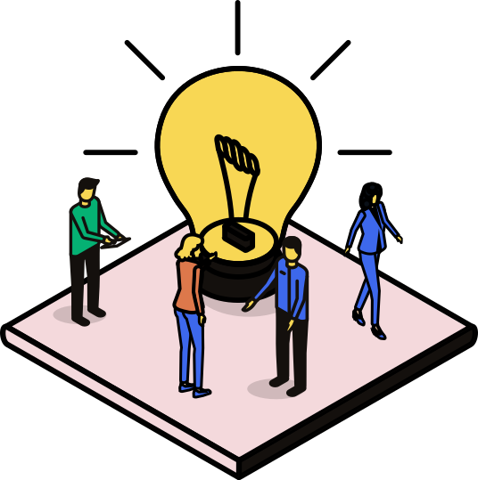

<!-- _class: cover -->

# Basispresentatie
## Ondertitel of domein

Naam Spreker · Rol · Maand Jaar

---

<!--
  INHOUD / AGENDA
  Gebruik de ol.agenda stijl voor een genummerde inhoudsopgave.
-->

# Inhoud

<ol class="agenda">
  <li>Inleiding</li>
  <li>Het verhaal</li>
  <li>Onze aanpak</li>
  <li>Onderwerpen</li>
  <li>Samenwerking</li>
  <li>Vragen</li>
</ol>

---

<!--
  SECTIEDELER
  Zwarte achtergrond met oranje zijbalk.
-->

<!-- _class: section-title -->

# Het verhaal uitgelegd

---

<!--
  TEKST + ILLUSTRATIE RECHTS
  Standaard contentslide: titel linksboven, tekst links, illustratie rechts.
  Pas de illustratie aan naar een passend bestand uit assets/illustraties/png/

-->

# Communicatie voor Npuls fase 2

Een nieuwe programmaorganisatie vraagt om een **vernieuwde communicatieaanpak**.

In deze presentatie nemen we je mee in het vernieuwde Npuls-verhaal, zodat jij goed kunt communiceren.

- Punt één van het verhaal
- Punt twee van het verhaal
- Punt drie van het verhaal

  

---

<!--
  STATEMENT / TAGLINE — groen, gecentreerd
  Groot statement dat het merk vertegenwoordigt.
-->

<!-- _class: green lead -->

# Onderwijs bewegen.

---

<!-- _class: pink -->

# Over Npuls.

In het Nationaal Groeifondsprogramma Npuls werken alle publieke mbo-scholen,
hogescholen en universiteiten aan de transformatie van het onderwijs.

**Samen** bouwen we aan een die blijvend bijdraagt aan een
veerkrachtige samenleving, brede welvaart en een sterke economie.

---

<!--
  FEITEN / STATISTIEKEN — roze achtergrond
  Asset 10 als decoratief element linksonder.
  Gebruik .stat en .stat-label voor grote getallen.
-->

<!-- _class: pink -->

## 8 jaar Npuls

Npuls duurt 8 jaar (2023–2031) en wordt gefinancierd door het Nationaal Groeifonds.

€640M

beschikbaar budget

€560M

vanuit NGF

€80M

co-financiering instellingen

---

<!--
  SECTIEDELER VARIANT — groen
-->

<!-- _class: green lead -->

# Waarom Npuls?
## Onderwijs is het motorblok van de samenleving.

---

<!--
  DONKERE SLIDE MET BULLETS + ILLUSTRATIE
    Tekst links, illustratie rechts. -->

<!-- _class: white -->

# We hebben in de samenleving te maken met:

- Snelle veranderingen in de maatschappij
- Uitdagingen rond digitalisering
- Veranderende arbeidsmarktbehoeften
- De opkomst en impact van AI

---

<!--
  DRIE GENUMMERDE KOLOMMEN — oranje achtergrond
  
  Gebruik .step-number voor de 01 / 02 / 03 prefix.
-->

<!-- _class: orange -->

# Daarom bouwen we in Npuls aan…

01

**Toegankelijkheid**

Zorgt dat alle lerenden toegang hebben tot het onderwijs.

02

**Kwaliteit**

De kwaliteit van het onderwijs doorlopend verbetert.

03

**Actualiteit**

De inhoud van het onderwijs actueel houdt en afstemt op nieuwe behoeften.

---

<!--
  SECTIEDELER BLAUW
  Gebruik: <!-- _class: blue lead -->
-->

<!-- _class: blue lead -->

# Waar werken we naartoe?
## De toekomst van het vervolgonderwijs.

---

<!--
  SPLIT IMAGE — illustratie links, tekst rechts
  Gebruik: <!-- _class: orange split-image -->

<!-- _class: orange split-image -->

# Transformatie van het onderwijs

Een toekomstbestendige onderwijssector vraagt om **transformatie**. In Npuls brengen we het onderwijs in beweging.

We werken aan gezamenlijke ambities en beschermen de **publieke waarden** om controle te houden over onze digitale infrastructuur.

---

<!--
  DRIE GELIJKE KOLOMMEN — wit, voor ambities of vergelijkingen
-->

# De drie ambities van Npuls zijn:

### AI en data waarde(n)vol inzetten
De lerende gebruikt AI goed en veilig.

### Leren zonder drempels
De lerende heeft regie op de eigen leer- en ontwikkelroute.

### Doorlopend het beste onderwijs
De lerende krijgt doorlopend actueel en kwalitatief goed onderwijs.

---

<!--
  TEKST + ILLUSTRATIE — oranje achtergrond
  Gebruik: <!-- _class: orange -->
  Twee kolommen: brede tekst links, illustratie rechts.
-->

<!-- _class: orange -->

## Waar we aan werken

AI transformeert snel hoe we leren, lesgeven en organiseren. Op het gebied van AI ontbreekt het in het vervolgonderwijs vaak aan samenhang, eigenaarschap en duidelijke kaders.

De rol van data blijft onderbelicht. Dit zet **publieke waarden** onder druk en vergroot de afhankelijkheid van commerciële partijen.

---

<!--
  BULLETS + GRAFISCH ELEMENT RECHTS — oranje achtergrond
  Bulletlijst links, Asset 16 (pijlen) als grafisch element rechts.
-->

<!-- _class: orange -->

## Samen transformeren…

- We zijn in gesprek en helpen elkaar bij het veranderen
- We ontwikkelen nieuwe toepassingen en passen die toe
- We maken nieuwe afspraken over samenwerking
- We bouwen aan een gedeelde kennisinfrastructuur

---

<!--
  SECTIEDELER — licht oranje, voor een nieuw onderwerp
  Gebruik: <!-- _class: light-orange lead -->
-->

<!-- _class: light-orange lead -->

# AI en data waarde(n)vol inzetten
## De toekomst van het vervolgonderwijs

---

<!--
  VIER THEMA-KAARTEN — licht oranje achtergrond
  Gebruik .columns-4 + .topic-card voor thematische kaarten.
  Sectordoelen-afbeeldingen passen goed als kaartillustratie.
-->

<!-- _class: light-orange -->

# Onderwerpen

**AI en data-geletterdheid**

**Verantwoord gebruik AI en data**

**Inzicht en strategie**

**Voorzieningen AI en data**

---

<!--
  ICON + TEKST KOLOMMEN — oranje achtergrond
  Gebruik .icon-card voor vertikale icon+label blokken.
-->

<!-- _class: orange -->

## Samen aan de slag

<i class="fa-solid fa-screwdriver-wrench fa-3x"></i>

**Regelingen**

Beschikbaar stellen van middelen en kaders.

<i class="fa-solid fa-flask fa-3x"></i>

**Pilots & adoptie**

Testen en verspreiden van nieuwe aanpakken.

<i class="fa-solid fa-users fa-3x"></i>

**Community's**

Verbinden van mensen en kennis.

---

<!--
  SECTORDOELEN — groen, gecentreerd
  Gebruik: <!-- _class: green lead -->
-->

<!-- _class: green lead -->

# Sectordoelen
## AI en data waarde(n)vol inzetten

---

<!--
  VORMENTAAL — Asset 11 rechtsonder (geel bg, blauwe + oranje cirkels)
  Combineer met een strong statement.
-->

<!-- _class: yellow -->

# Npuls beweegt onderwijs.

We bouwen aan een toekomstbestendige onderwijssector die bijdraagt aan een veerkrachtige samenleving.

---

<!--
  VORMENTAAL — Asset 14 (groen bg, roze cirkels) als decoratief element
-->

<!-- _class: green -->

# Samenwerking

Met de MBO Raad, Vereniging Hogescholen, Universiteiten van Nederland, SURF en vele andere partnerorganisaties.

---

<!--
  AFSLUITING / CTA — groen, gecentreerd
  Gebruik: <!-- _class: green lead -->
-->

<!-- _class: green lead center -->

# Meer informatie?
## npuls.nl

---

<!--
  EINDSLIDE — roze, met payoff
  Gebruik: <!-- _class: pink lead center -->
-->

<!-- _class: pink lead center -->

# Onderwijs bewegen.

